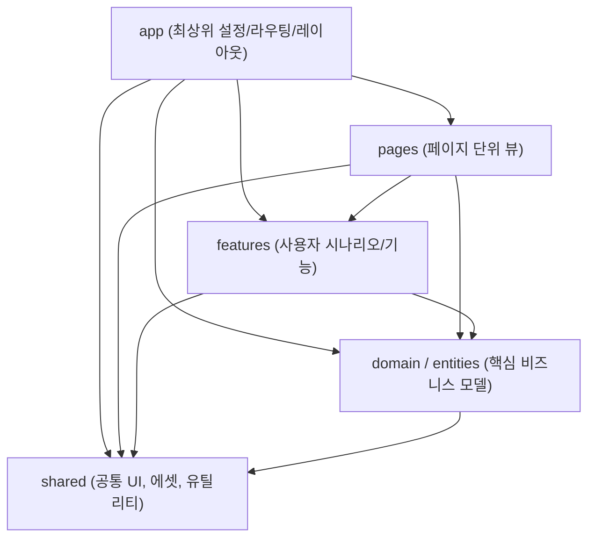

# Shared Layer 컴포넌트 및 에셋(이미지) 참조 가이드

본 문서는 Vite + React + TypeScript 환경에서 FSD(Feature-Sliced Design) 아키텍처를 기반으로 `shared` 레이어의 정적 자원(이미지, SVG) 및 공통 컴포넌트/라이브러리를 각 레이어(`app`, `pages`, `features`, `domain`)에서 효율적이고 일관되게 참조하는 방법을 정리합니다.

---

## 1. 개요 및 도입 배경

### 상대 경로 참조의 한계
프로젝트가 확장되고 디렉토리 깊이가 깊어지면 아래와 같이 상대 경로 계산이 복잡해지고, 파일 위치 이동 시 import 경로가 깨지기 쉽습니다.
```tsx
// ❌ 복잡하고 불안정한 상대 경로
import viteLogo from "../../../shared/assets/vite.svg";
import { Button } from "../../../../shared/ui/button";
```

### 경로 별칭(Path Alias: `@/*`)과 배럴 익스포트(Barrel Export)
- **경로 별칭 (`@/`)**: `src` 루트 디렉토리를 기준으로 하는 직관적인 절대 경로 참조 제공.
- **배럴 익스포트 (`index.ts`)**: 폴더 단위로 `index.ts`를 두고 모듈을 한곳에서 모아 내보내어 import 경로 단축.

```tsx
//  직관적이고 유지보수가 용이한 절대 경로 + 배럴 참조
import { viteLogo } from "@/shared/assets";
import { Button } from "@/shared/ui";
```

---

## 2. 필수 환경 설정

### ① Vite 번들러 설정 (`vite.config.ts`)
Node.js ESM 표준 모듈 방식(`fileURLToPath`, `URL`)을 사용하여 번들러가 `@`를 `src` 폴더로 매핑하도록 설정합니다.

```ts
import react from '@vitejs/plugin-react'
import { fileURLToPath, URL } from 'node:url'
import { defineConfig } from 'vite'

export default defineConfig({
  plugins: [react()],
  resolve: {
    alias: {
      '@': fileURLToPath(new URL('./src', import.meta.url)),
    },
  },
})
```

### ② TypeScript 컴파일러 설정 (`tsconfig.app.json`)
TypeScript 6.0+ 최신 사양에서는 기존 `baseUrl` 옵션이 deprecated(비권장) 처리되었습니다.  
따라서 `baseUrl` 없이 `"paths"`에 직접 상대 경로(`["./src/*"]`)를 지정합니다.

```json
{
  "compilerOptions": {
    /* Bundler mode */
    "moduleResolution": "bundler",
    "paths": {
      "@/*": ["./src/*"]
    },
    "allowImportingTsExtensions": true,
    "verbatimModuleSyntax": true,
    "noEmit": true,
    "jsx": "react-jsx"
  },
  "include": ["src"]
}
```

---

## 3. 정적 자원(이미지, SVG) 참조 방법

### ① Assets 배럴 파일 구성 (`src/shared/assets/index.ts`)
정적 이미지 및 SVG 파일을 `shared/assets` 디렉토리 내부의 `index.ts`에서 일괄 export합니다.

```ts
// src/shared/assets/index.ts
export { default as viteLogo } from "./vite.svg";
export { default as reactLogo } from "./react.svg";
export { default as heroImg } from "./hero.png";
```

### ② 컴포넌트에서의 Import 및 사용 예시
```tsx
// src/app/layout/ui/app-header.tsx
import { viteLogo } from "@/shared/assets";

export const Header = () => {
  return (
    <header className="page-header">
      <div className="page-header-logo">
        
      </div>
    </header>
  );
};
```

---

## 4. 공통 UI 컴포넌트(`shared/ui`) 참조 방법

### ① UI 배럴 파일 구성 권장안 (`src/shared/ui/index.ts`)
```ts
// src/shared/ui/index.ts
export * from "./button";
export * from "./input";
export * from "./modal";
```

### ② 상위 레이어에서의 사용 예시
```tsx
// src/features/auth/ui/login-form.tsx
import { Button, Input } from "@/shared/ui";

export const LoginForm = () => {
  return (
    <form>
      <Input type="email" placeholder="이메일 입력" />
      <Button variant="primary">로그인</Button>
    </form>
  );
};
```

---

## 5. 공통 라이브러리/유틸(`shared/lib`) 참조 방법

```ts
// src/shared/lib/index.ts
export * from "./date-utils";
export * from "./api-client";
```

```tsx
// src/pages/dashboard/ui/dashboard-page.tsx
import { formatDate } from "@/shared/lib";
```

---

## 6. 레이어드 아키텍처(FSD) 참조 규칙

FSD(Feature-Sliced Design) 아키텍처에서는 **상위 레이어는 하위 레이어를 참조할 수 있지만, 하위 레이어는 상위 레이어를 참조할 수 없습니다.** (단방향 의존성 규칙)



### 레이어별 참조 예시 표

| 참조 주체 레이어 | 참조 대상 레이어 | 올바른 Import 예시 | 설명 |
| :--- | :--- | :--- | :--- |
| **`app`** | `shared` | `import { viteLogo } from "@/shared/assets";`<br/>`import { AppHeader } from "@/shared/ui";` | 레이아웃 헤더/푸터 등에서 공통 에셋 및 UI 참조 |
| **`pages`** | `shared` | `import { formatDate } from "@/shared/lib";` | 화면 구성 시 공통 유틸/포맷터 참조 |
| **`pages`** | `features` | `import { LoginForm } from "@/features/auth";` | 페이지 단위에서 기능 블록 조립 |
| **`features`** | `domain` | `import type { User } from "@/domain/user";` | 사용자 기능 구현 시 핵심 도메인 모델 참조 |
| **`features`** | `shared` | `import { Button } from "@/shared/ui";` | 기능 단위 폼/버튼에 공통 UI 컴포넌트 재사용 |
| **`domain`** | `shared` | `import { apiClient } from "@/shared/lib";` | API 요청 클라이언트 및 공통 에러 핸들러 참조 |

---

## 7. 주의사항 및 Best Practices

1. **하위 레이어의 역참조 금지 (No Reverse Dependency)**
   - `shared` 레이어 내부 파일에서는 절대 `app`, `pages`, `features`, `domain`을 import해서는 안 됩니다.
   - `shared`는 어떠한 비즈니스 로직에도 종속되지 않는 순수 공통 모듈이어야 합니다.

2. **동일 슬라이스 내부 참조 시 상대 경로 사용**
   - 같은 컴포넌트 디렉토리 내부(예: `button.tsx`가 `button.css`를 참조할 때)는 `./button.css`와 같은 상대 경로를 사용하고, 다른 모듈/레이어를 참조할 때 `@/...` 절대 경로 별칭을 사용하는 것이 직관적입니다.

3. **TypeScript 6.0+ 빌드 준수**
   - `tsconfig.app.json`에 `baseUrl`을 사용하지 않고 `"@/*": ["./src/*"]` 형태를 유지하여 빌드 경고 및 에러를 예방합니다.
