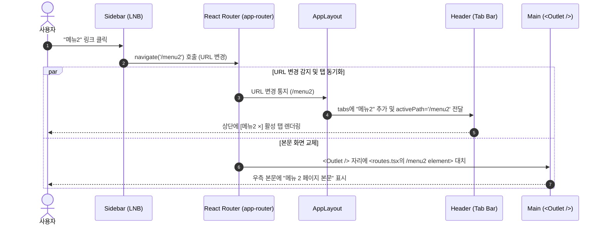

# 애플리케이션 레이아웃 구조 및 라우팅 동작 가이드

이 문서는 [`src/app/layout/ui/`]에 구성된 컴포넌트들의 화면 배치와, [`src/app/routes/`]를 통한 페이지 렌더링 동작 구조를 설명합니다.

---

## 1. 전체 화면 레이아웃 다이어그램 (화면 구조도)

브라우저 전체 높이(`100vh`)를 기준으로 Flexbox 기반으로 분할되어 있습니다.

```text
┌─────────────────────────────────────────────────────────────────────────────────────────────┐
│ .page-wrapper (전체 높이 100vh, flex-direction: column)                                     │
├─────────────────────────────────────────────────────────────────────────────────────────────┤
│ .page-header                                                                                │
│ ┌─────────────────────────┬───────────────────────────────────────────────────────────────┐ │
│ │ .page-header-logo (20%) │ .page-header-right (80%)                                      │ │
│ │                         │ ┌───────────────────────────────┐ ┌─────────────────────────┐ │ │
│ │ (로고 텍스트 &          │ │ .nav-list                     │ │ .page-header-logout-btn │ │ │
│ │  8px 다이아몬드 경계선) │ │ ┌─────────────────┐ ┌───────┐ │ │                         │ │ │
│ │                         │ │ │ .page-header-tab│ │ (tab) │ │ │ [로그아웃]              │ │ │
│ │                         │ │ │ [.tab-close-btn]│ │       │ │ │                         │ │ │
│ │                         │ │ └─────────────────┘ └───────┘ │ │                         │ │ │
│ │                         │ └───────────────────────────────┘ └─────────────────────────┘ │ │
│ └─────────────────────────┴───────────────────────────────────────────────────────────────┘ │
├─────────────────────────────────────────────────────────────────────────────────────────────┤
│ .page-body (flex: 1, flex-direction: row)                                                   │
│ ┌─────────────────────────┬───────────────────────────────────────────────────────────────┐ │
│ │ .app-sidebar (20%)      │ .app-main (80%)                                               │ │
│ │ ┌─────────────────────┐ │ ┌───────────────────────────────────────────────────────────┐ │ │
│ │ │ .sidebar-nav-list   │ │ │ .main-header (하단 border-bottom 여백 적용)               │ │ │
│ │ │                     │ │ │  <h3>{title}</h3>                                         │ │ │
│ │ │ - .sidebar-nav-link │ │ └───────────────────────────────────────────────────────────┘ │ │
│ │ │   (메뉴1: .active)  │ │ ┌───────────────────────────────────────────────────────────┐ │ │
│ │ │ - .sidebar-nav-link │ │ │ .main-content                                             │ │ │
│ │ │   (메뉴2)           │ │ │                                                           │ │ │
│ │ │ - .sidebar-nav-link │ │ │   ★ <Outlet /> 위치 ★                                     │ │ │
│ │ │   (메뉴3)           │ │ │   (routes.tsx의 하위 페이지 컴포넌트 표시 영역)           │ │ │
│ │ │                     │ │ │   예: <div>메뉴 1 페이지 본문</div>                       │ │ │
│ │ └─────────────────────┘ │ └───────────────────────────────────────────────────────────┘ │ │
│ └─────────────────────────┴───────────────────────────────────────────────────────────────┘ │
└─────────────────────────────────────────────────────────────────────────────────────────────┘
```

---

## 2. 배치 순서별 컴포넌트 상세 설명

### 2-1. AppLayout('/src/app/layout/ui/app-layout.container.tsx') (최상위 부모 컨테이너)
* **역할**: 전체 레이아웃의 틀(`.page-wrapper`, `.page-body`)을 구성하고, 자식 컴포넌트들이 공유하는 상태(다중 탭 목록, 현재 활성 경로)를 총괄 관리합니다.
* **주요 기능**:
  - `useLocation()`을 통해 URL 변경을 실시간 감지하여 상단 탭 목록에 신규 메뉴를 자동 추가합니다.
  - 상단 탭 삭제(`×`) 시 남아 있는 인접 탭으로 자동 라우팅 이동을 수행합니다.

### 2-2. Header('/src/app/layout/ui/app-header.tsx') (상단 고정 바)
* **배치**: 페이지 최상단 가로 전체 영역
* **구성 요소**:
  - **로고(`.page-header-logo`)**: 좌측 20% 너비를 차지하며, Sidebar 너비와 일치하도록 정렬됩니다. 우측 끝에는 Sidebar 스크롤바(8px)와 이어지는 다이아몬드 그라데이션 경계선(`::after`)이 위치합니다.
  - **탭 네비게이션(`.nav-list`)**: LNB에서 클릭한 메뉴들이 가로 탭(`.page-header-tab`) 형태로 순서대로 쌓입니다. 각 탭 우측 상단에는 `×` 삭제 버튼이 있어 원하는 탭을 닫을 수 있습니다.
  - **로그아웃 버튼(`.page-header-logout-btn`)**: 우측 끝에 위치합니다.

### 2-3. Sidebar('/src/app/layout/ui/app-sidebar.tsx') (좌측 LNB 영역)
* **배치**: 본문(`.page-body`)의 좌측 20% 고정 너비 (`flex: 0 0 20%`)
* **구성 요소**:
  - React Router의 `<NavLink>`로 구성된 메뉴 목록 (`메뉴1` ~ `메뉴5`).
  - 현재 브라우저 주소(URL)와 일치하는 메뉴에 `.active` 클래스가 자동으로 부여되어 파란색 굵은 텍스트로 하이라이트됩니다.
  - 내용이 길어질 경우 8px 두께의 커스텀 스크롤바가 활성화됩니다.

### 2-4. Main ('src/app/layout/ui/app-main.tsx') (우측 본문 영역)
* **배치**: 본문(`.page-body`)의 나머지 80% 가변 영역 (`flex: 1`)
* **구성 요소**:
  - **헤더(`.main-header`)**: 현재 활성화된 페이지 제목(`<h3>{title}</h3>`)을 표시하며, 하단 테두리 선이 좌우 끝까지 닿지 않도록 마진이 적용되어 있습니다.
  - **콘텐츠 본문(`.main-content`)**: **`<Outlet />`**이 위치하여, 라우터가 URL에 매칭되는 실제 화면 컴포넌트를 이 영역에 렌더링합니다.

---

## 3. 라우팅을 통한 페이지 표시 동작 흐름 (Routes 연동)



### [routes.tsx]('/src/app/routes/routes.tsx') 구조 매핑

```tsx
export const routes: RouteObject[] = [
  {
    path: "/",
    element: <AppLayout />, // 1. 공통 부모 레이아웃이 항상 유지됨
    children: [
      {
        index: true,
        element: <Navigate to="/menu1" replace />, // '/' 접근 시 '/menu1'로 리다이렉트
      },
      {
        path: "menu1",
        element: <div>메뉴 1 페이지 본문</div>, // 2. URL이 /menu1일 때 <Outlet />에 대치
      },
      {
        path: "menu2",
        element: <div>메뉴 2 페이지 본문</div>, // 3. URL이 /menu2일 때 <Outlet />에 대치
      },
      // ...
    ],
  },
];
```

* 사용자가 LNB나 상단 탭을 클릭하여 URL이 변경되면, **`AppLayout`의 외형(Header와 Sidebar)은 다시 렌더링되거나 깜빡이지 않고 고정**된 상태를 유지합니다.
* 오직 [Main](/src/app/layout/ui/app-main.tsx) 내부의 **`<Outlet />` 위치에만 해당 라우트의 컴포넌트(`<div>메뉴 X 페이지 본문</div>`)가 부드럽게 교체**되어 표시됩니다.
