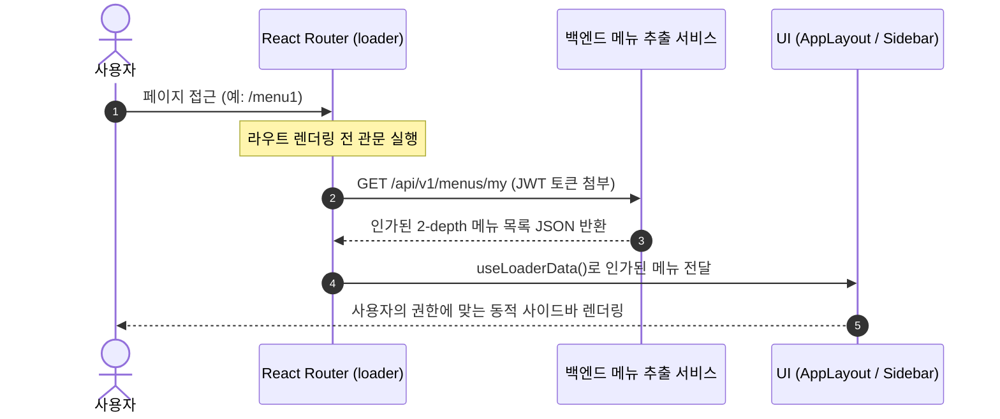

# 메뉴 리스트 데이터 구성 가이드 (향후 메뉴 추출 서비스 연동 포함)

본 문서는 프론트엔드 애플리케이션에서 **정적 메뉴(Static Menu)**와 **권한 기반 동적 메뉴(Dynamic RBAC Menu)**의 구성 원리를 비교 분석하고, 향후 백엔드 API(메뉴 추출 서비스)와 연동할 때 권장되는 실무 아키텍처 패턴을 정리합니다.

---

## 1. 개요: 정적 메뉴 vs 동적 권한 메뉴

| 구분 | 정적 메뉴 (Static Menu) | 동적 권한 메뉴 (Dynamic Menu) |
| :--- | :--- | :--- |
| **데이터 원천** | 프론트엔드 코드 내 하드코딩된 상수 | 백엔드 API (DB 저장된 메뉴 및 사용자 권한) |
| **접근 대상** | 로그인 여부와 무관하게 모든 사용자에게 동일한 화면 | 사용자 계정의 권한(Role/Permission)에 따라 차등 제공 |
| **선언 위치** | 컴포넌트 바깥 (모듈 스코프 상수) | React Router `loader` |
| **실행 타이밍** | 자바스크립트 파일 로드 시 1회 평가 | 라우팅 진입(Route Navigation) 시 사전 실행 |

---

## 2. 정적 메뉴 구성 (현재 방식: 모듈 스코프 상수)

현재 `app-sidebar.tsx`에서 사용 중인 방식입니다.

```tsx
// src/app/layout/ui/app-sidebar.tsx
// 1. 컴포넌트 바깥(모듈 스코프)에 불변 상수로 정의
const MENU_ITEMS = [
  { name: "메뉴1", path: "/menu1" },
  { name: "메뉴2", path: "/menu2" },
  { name: "메뉴3", path: "/menu3" },
  { name: "메뉴4", path: "/menu4" },
  { name: "메뉴5", path: "/menu5" },
];

const Sidebar = () => {
  return (
    <aside className="app-sidebar">
      <nav>
        <ul className="sidebar-nav-list">
          {MENU_ITEMS.map((item) => (
            <li key={item.path}>
              <NavLink to={item.path}>{item.name}</NavLink>
            </li>
          ))}
        </ul>
      </nav>
    </aside>
  );
};
```

### 왜 함수 바깥(모듈 스코프)에 배치하는가?
1. **리렌더링 시 메모리 재할당 방지 (GC 부하 제거)**:
   - 함수 컴포넌트 내부에 배열을 선언하면 상태/URL이 바뀔 때마다 매번 새로운 배열 인스턴스가 생성됩니다.
   - 외부에 선언하면 파일 로드 시 메모리에 **딱 1회만 생성**되고 영구히 재사용됩니다.
2. **참조 동일성(Reference Identity) 유지**:
   - `useEffect`의 의존성 배열에 전달되거나 자식 컴포넌트의 props로 전달되어도 불필요한 리렌더링을 유발하지 않습니다.
3. **적용 적합 사례**:
   - 모든 사용자에게 동일하게 노출되는 공개 사이트 메뉴, 푸터 링크, 튜토리얼 단계 등.

---

## 3. 동적 권한 메뉴: 함수 바깥에서 API를 호출하면 안 되는 이유

실무 엔터프라이즈/어드민 시스템에서는 **로그인한 사용자의 직책/권한(Role: ADMIN, MANAGER, USER 등)**에 따라 사이드바 메뉴가 달라집니다.

> ⚠️ **주의: 함수 바깥(모듈 스코프)에서 백엔드 API를 직접 호출할 수 없는 이유**
> 1. **실행 시점의 문제**: 모듈 스코프는 브라우저가 번들 스크립트를 처음 파싱할 때 실행됩니다. 이 시점에는 사용자가 로그인 상태인지, 브라우저 스토리지에 JWT 인증 토큰이 있는지 알 수 없습니다.
> 2. **비동기 렌더링 동기화 불가**: API 호출은 비동기(Promise)이므로, 데이터를 받아오기 전까지 렌더링을 지연하거나 결과를 리액트 상태(`useState`)에 안전하게 주입할 수 없습니다.

---

## 4. 실무 표준: React Router `loader` 기반 동적 메뉴 연동 아키텍처

실무 어드민/엔터프라이즈 환경에서는 과거에 사용되던 전역 상태 저장 방식(Zustand/Jotai)이나 클라이언트 필터링 방식을 지양하고, **React Router의 `loader`를 단일 진실 공급원(Single Source of Truth)으로 삼아 데이터를 공급하고 보호(Route Guard)하는 방식이 유일한 실무 표준**으로 사용됩니다.

### 💡 과거 방식들의 치명적 한계
- **클라이언트 사이드 권한 필터링의 한계 (보안 취약점)**:  
  사이드바 UI에서만 버튼을 숨길 뿐, 사용자가 주소창에 `/admin` 경로를 직접 타이핑해 진입하면 화면이 그대로 노출됩니다.
- **전역 상태(Store) 저장 방식의 한계 (깜빡임 & 동기화 문제)**:  
  새로고침 시 전역 스토어가 초기화되어 메뉴가 사라졌다가 다시 나타나는 깜빡임(Flickering)이 발생하고, 스토어와 라우터 간 상태 불일치 문제가 생깁니다.

---

### 📌 실무 표준 구현: React Router `loader` 사전 패칭 & 라우트 가드

```tsx
// 1. 라우트 정의 (src/app/routes/routes.tsx)
import { redirect } from "react-router-dom";
import AppLayout from "../layout/ui/app-layout.container";
import { menuService } from "@/entities/menu/api/menu-service";

export const routes: RouteObject[] = [
  {
    path: "/",
    element: <AppLayout />,
    // 라우트 진입 전 관문(Guard): 인증 검증 및 인가 메뉴 목록 패칭
    loader: async () => {
      const token = localStorage.getItem("accessToken");
      if (!token) {
        // 비인가자는 즉시 로그인 화면으로 튕겨냄 (보안 철통 방어)
        throw redirect("/login");
      }

      // 백엔드에서 사용자 권한에 맞는 인가 메뉴만 조회
      const menus = await menuService.getAuthorizedMenuList();
      return { menus };
    },
    children: [ /* ... 업무 화면 라우트 */ ],
  },
];

// 2. 사이드바 컴포넌트 (src/app/layout/ui/app-sidebar.tsx)
import { useLoaderData, NavLink } from "react-router-dom";
import type { MenuItem } from "@/entities/menu/model/types";

const Sidebar = () => {
  // 별도의 전역 스토어나 useEffect 없이, loader가 반환한 데이터를 즉시 렌더링
  const { menus } = useLoaderData() as { menus: MenuItem[] };

  return (
    <aside className="app-sidebar">
      <nav>
        <ul className="sidebar-nav-list">
          {menus.map((item) => (
            <li key={item.path}>
              <NavLink
                to={item.path}
                className={({ isActive }) =>
                  `sidebar-nav-link ${isActive ? "active" : ""}`.trim()
                }
              >
                {item.name}
              </NavLink>
            </li>
          ))}
        </ul>
      </nav>
    </aside>
  );
};
```

---

## 5. 향후 백엔드 "메뉴 리스트 추출 서비스" 연동 가이드

향후 백엔드 API 연동을 도입할 경우 권장되는 단계별 아키텍처 설계입니다.

### ① 메뉴 데이터 모델 정의 (`src/entities/menu/model/types.ts`)
```ts
export interface MenuItem {
  id: string;
  name: string;
  path: string;
  icon?: string;
  roles?: string[];
  sortOrder?: number;
  children?: MenuItem[]; // 2-depth 트리형 서브메뉴 지원 시
}
```

### ② 메뉴 추출 서비스 API 모듈 (`src/entities/menu/api/menu-service.ts`)
```ts
import { apiClient } from "@/shared/lib";
import type { MenuItem } from "../model/types";

export const menuService = {
  // 로그인된 사용자의 인가된 메뉴 목록 조회 API
  getAuthorizedMenuList: async (): Promise<MenuItem[]> => {
    const response = await apiClient.get<MenuItem[]>("/api/v1/menus/my");
    return response.data;
  },
};
```

### ③ 라우터 `loader` 및 컴포넌트 연동 흐름 (Sequence)



---

## 6. 결론 및 권장 가이드

1. **현재 단계 (프로토타입 / 고정 메뉴)**: 
   - 고정된 메뉴 개발 단계에서는 지금처럼 `const MENU_ITEMS = [...]`를 **모듈 스코프 상수**로 관리하는 것이 메모리 및 성능상 가장 올바릅니다.
2. **향후 API 연동 단계 (실무 엔터프라이즈 표준)**: 
   - 백엔드 메뉴 서비스가 구축되면 전역 스토어 없이 **React Router `loader` 사전 패칭 & 라우트 가드 단일 방식**으로 전환하여 완벽한 권한 통제 및 깜빡임 없는 UX를 구축합니다.
