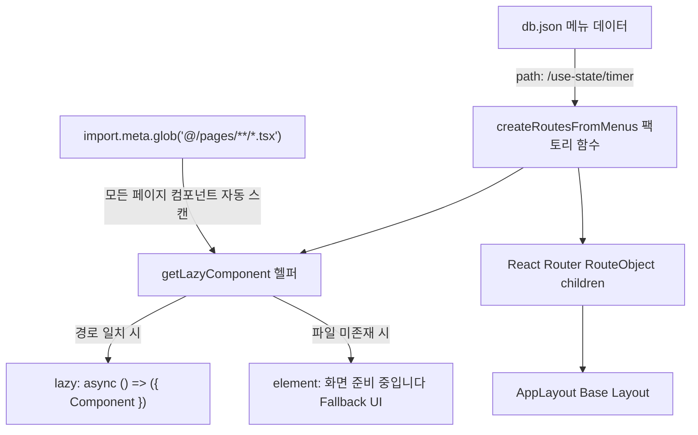

# 메뉴 리스트의 path 속성으로 pages Layer 컴포넌트를 매칭하여 RouteObject children 생성 방법

본 문서는 Vite 환경에서 **메뉴 리스트 메타데이터(`db.json` / `Menu[]`)의 `path` 속성**과 **`src/pages` 디렉터리의 화면 컴포넌트**를 1:1로 자동 매칭하여, React Router의 `RouteObject` 중첩 `children` 배열을 **제로-컨피그(Zero-Config) 및 온디맨드 `lazy` 코드 스플리팅**으로 자동 생성하는 실무 구현 기법을 정리합니다.

또한 FSD(Feature-Sliced Design) 아키텍처 원칙에 따라, 비즈니스 로직을 포함하는 **`widgets` Layer 컴포넌트를 `pages` Layer 컴포넌트에서 조합(Composition)하는 설계 원칙**을 함께 설명합니다.

---

## 1. 개요: 수작업 라우트 매핑의 한계와 자동화 필요성

### 💡 기존 수작업 방식의 문제점
1. **경로 불일치 버그 (Human Error)**:
   - 사이드바 메뉴 파일([db.json](file:///d:/project-workspace/vite-react-hooks/db.json))의 경로와 [routes.tsx](file:///d:/project-workspace/vite-react-hooks/src/app/routes/routes.tsx)에 선언된 경로가 조금만 달라도 404 페이지 오류가 발생합니다.
2. **반복적인 하드코딩과 유지보수 비용**:
   - 새 메뉴가 추가될 때마다 개발자가 `routes.tsx`에 `import` 문을 추가하고 `RouteObject` 배열에 수십 줄의 코드를 작성해야 합니다.
3. **초기 번들 비대화**:
   - 화면 컴포넌트들을 파일 상단에서 정적으로 `import`하면 첫 화면 접속 시 방문하지도 않을 수십 개의 화면 코드가 한 번에 다운로드되어 로딩 속도가 저하됩니다.

### 🎯 해결 목표
* **단일 진실 공급원(Single Source of Truth)**: 메뉴 데이터([db.json](file:///d:/project-workspace/vite-react-hooks/db.json)) 하나만 수정하면 라우터가 100% 자동으로 생성됩니다.
* **제로-컨피그 (Zero-Config)**: 컴포넌트 매핑 사전(`COMPONENT_REGISTRY`) 없이 Vite의 **`import.meta.glob`**으로 파일 시스템을 자동 스캔합니다.
* **온디맨드 지연 로딩 (`lazy`)**: 실제 사용자가 사이드바에서 해당 2 depth 메뉴를 **클릭하는 순간에만** 해당 화면 파일(`.js` 청크)을 다운로드합니다.

---

## 2. 전체 데이터 흐름 및 아키텍처



---

## 3. 핵심 구현 코드 및 원리 상세

### ① Vite `import.meta.glob`을 통한 페이지 자동 스캔

`src/app/routes/routes.tsx`에서 `@/pages` 디렉터리 하위의 모든 `.tsx` 파일들을 자동으로 스캔합니다.

```ts
/**
 * [Vite import.meta.glob 기반 제로-컨피그 자동 수집]
 * - COMPONENT_REGISTRY와 같은 수작업 하드코딩 맵을 완전히 제거합니다.
 * - Vite의 경로 별칭('@')을 활용하여 '@/pages' 하위의 모든 .tsx 파일들을 자동으로 스캔합니다.
 * - 결과 객체 형태:
 *   {
 *     '@/pages/use-state/timer.tsx': () => import('@/pages/use-state/timer.tsx'),
 *     '@/pages/use-state/set-state-callback.tsx': () => import('@/pages/use-state/set-state-callback.tsx'),
 *     ...
 *   }
 */
const PAGE_MODULES = import.meta.glob<{ default: ComponentType }>('@/pages/**/*.tsx');
```

---

### ② URL `path` $\rightarrow$ 파일 경로 1:1 매칭 헬퍼 함수 (`getLazyComponent`)

메뉴 객체의 `path` 문자열(예: `'/use-state/timer'`)을 파일 경로(예: `'@/pages/use-state/timer.tsx'`)로 변환하여 매칭합니다.

```ts
/**
 * [URL path 기반 온디맨드 lazy 로더 자동 매칭 헬퍼 함수]
 * - 메뉴의 path(예: '/use-state/timer')를 파일 경로('@/pages/use-state/timer.tsx')로 변환하여
 *   일치하는 파일이 존재하면 React Router의 lazy 속성에 맞는 온디맨드 로더 함수를 반환합니다.
 * - 실제 메뉴를 클릭하는 시점에만 해당 컴포넌트의 번들 청크(.js)가 네트워크로 다운로드됩니다.
 * - 파일이 존재하지 않는 경우 undefined를 반환하여 Fallback UI가 출력되도록 안전하게 처리합니다.
 */
function getLazyComponent(path: string) {
  // @ 별칭 기반 파일 경로로 1:1 매칭 (예: '@/pages/use-state/timer.tsx')
  const filePath = `@/pages${path}.tsx`;
  const importFn = PAGE_MODULES[filePath];

  if (!importFn) return undefined;

  // React Router v6.4+ lazy 규격: { Component } 객체를 비동기 반환
  return async () => {
    const module = await importFn();
    return { Component: module.default };
  };
}
```

---

### ③ `createRoutesFromMenus` 라우트 팩토리 함수

메뉴 리스트(`Menu[]`)를 순회하며 1 depth 그룹 중첩 라우트 및 2 depth Leaf Node 라우트를 자동 생성합니다.

```ts
/**
 * [라우트 자동 생성 팩토리 함수]
 * - 메뉴 메타데이터(Menu[])를 순회하면서 React Router의 RouteObject[] 배열을 자동 생성합니다.
 * - 1 depth 부모 그룹 및 2 depth 서브메뉴 구조를 자동으로 파싱합니다.
 * - 컴포넌트 파일이 아직 없는 메뉴는 '준비 중' 안내 UI를 자동으로 렌더링합니다.
 */
function createRoutesFromMenus(menus: Menu[]): RouteObject[] {
  return menus.map((menu) => {
    // 1. 자식(children)이 존재하는 1 depth 계층형 메뉴 (중첩 라우팅 자동 생성)
    if (menu.children && menu.children.length > 0) {
      const parentPath = menu.path.replace(/^\//, ''); // 루트 상대 경로화 (예: 'use-state')
      const firstChildRelativePath = menu.children[0].path.split('/').pop() || '';

      return {
        path: parentPath,
        children: [
          // 1depth 부모 경로(/use-state) 진입 시 첫 번째 자식 메뉴로 자동 리다이렉트
          {
            index: true,
            element: <Navigate to={firstChildRelativePath} replace />,
          },
          // 2depth 자식 라우트 목록을 import.meta.glob 기반으로 자동 연결
          ...menu.children.map((child) => {
            const childRelativePath = child.path.split('/').pop() || child.path;
            const lazyLoader = getLazyComponent(child.path);

            return {
              path: childRelativePath,
              // 파일이 존재하면 클릭 시 온디맨드로 다운로드되는 lazy 적용
              lazy: lazyLoader,
              // 파일이 아직 없는 메뉴는 안전한 Fallback UI 렌더링
              element: !lazyLoader ? (
                <div style={{ padding: '24px' }}>{child.name} 화면 준비 중입니다.</div>
              ) : undefined,
            };
          }),
        ],
      };
    }

    // 2. 자식이 없는 단일 1 depth 메뉴 (예: /menu4, /menu5)
    const relativePath = menu.path.replace(/^\//, '');
    const lazyLoader = getLazyComponent(menu.path);

    return {
      path: relativePath,
      lazy: lazyLoader,
      element: !lazyLoader ? (
        <div style={{ padding: '24px' }}>{menu.name} 화면 준비 중입니다.</div>
      ) : undefined,
    };
  });
}
```

---

### ④ `routes.tsx` 적용

```tsx
export const routes: RouteObject[] = [
  {
    path: '/',
    id: 'root',
    element: <AppLayout />, // 공통 헤더, 사이드바, 메인 본문 Base Layout
    loader: appLayoutLoader, // 화면 렌더링 전 메뉴 데이터 사전 패칭
    children: [
      // 1. Index Route (최초 진입 시 기본 시작 페이지로 리다이렉트)
      {
        index: true,
        element: <Navigate to="/use-state/timer" replace />,
      },
      // 2. 메뉴 데이터와 파일 시스템(import.meta.glob)으로부터 100% 자동 생성된 라우트 목록
      ...createRoutesFromMenus(DEFAULT_MENUS),
      // 3. Catch-all 라우트 (404 예외 처리)
      {
        path: '*',
        element: <div>페이지를 찾을 수 없습니다. (404)</div>,
      },
    ],
  },
];
```

---

## 4. 실무 개발 워크플로우의 변화

새로운 화면을 개발할 때 거치는 절차가 혁신적으로 단축됩니다:

1. **화면 파일 생성**: `src/pages/use-reducer/counter.tsx` 생성
2. **메뉴 등록**: `db.json`에 `{ "name": "useReducer-카운터", "path": "/use-reducer/counter" }` 추가
3. **완료!**: 라우터 파일(`routes.tsx`)을 **단 한 줄도 건드리지 않아도** 사이드바에 메뉴가 노출되고, 클릭 시 해당 컴포넌트가 지연 로딩(`lazy`)되어 정상 화면으로 오픈됩니다.

---

## 5. [참고사항 / FSD 아키텍처 가이드] `widgets` 컴포넌트를 `pages` Layer에서 조합하는 원칙

### 💡 질문: "라우터가 `widgets` 컴포넌트를 직접 불러오면 안 되나요?"
> **답변: 기술적으로는 가능하지만, FSD(Feature-Sliced Design) 아키텍처에서는 `pages` Layer 컴포넌트가 `widgets` 컴포넌트들을 조합(Composition)하는 것이 정석입니다.**

---

### ① Layer별 본질적인 역할과 책임 비교

| 계층 (Layer) | 역할 및 책임 | 비즈니스 로직 유무 | 재사용성 |
| :--- | :--- | :--- | :--- |
| **`shared/ui`** | 버튼, 모달, 인풋, 카드 등 **순수한 디자인 시스템 UI 부품** | ❌ **전혀 없음** (API 호출 안 함) | 어떤 프로젝트에 가져가도 재사용 가능 |
| **`widgets`** | 특정 도메인의 데이터 조회 및 동작을 완결한 **독립적인 비즈니스 UI 블록** | ⭕ **명확히 존재** (API 호출, 상태 보유) | 서비스 내 여러 화면에서 독립적으로 재사용 |
| **`pages`** | URL 경로와 1:1로 매핑되는 **최상위 화면 단위이자 조립 공간** | ❌ **직접 로직 없음** (위젯 배치/조율만 담당) | 라우트 전용 |

---

### ② 비유로 이해하는 구조 (레고 블록과 조립 공간)

* **`shared/ui` (나사, 플라스틱 원료)**: 나사, 플라스틱 조각 같은 기초 원자 부품 (`<Button>`, `<Input>`)
* **`widgets` (완성된 기계 부품)**: 엔진, 바퀴, 계기판처럼 특정 기능을 완결하는 독립 부품 (`<TimerWidget>`, `<UserTableWidget>`)
* **`pages` (완성차 조립 라인)**: 부품들을 가져와 자동차 한 대의 공간으로 완성하는 조립실 (`<TimerPage>`)
* **라우터 (URL)**: 고객이 완성차 전시장에 들어오는 **문 (`/use-state/timer`)**

고객은 전시장 문을 열고 완성된 방(`pages`)에 들어가지, 낱개 부품인 바퀴(`widgets`)만 보러 문을 열지 않습니다.

---

### ③ 왜 `pages`에서 `widgets`를 조합해야 하는가?

#### 1) 단일 위젯 비대화 방지
만약 라우터가 `widgets`를 바로 호출하도록 설계하면, 나중에 화면에 검색 필터 위젯, 통계 요약 카드 위젯 등이 추가될 때 **기존 단일 위젯 안에 모든 기능을 억지로 쑤셔 넣어야 하므로 컴포넌트가 거대해지고 재사용이 불가능**해집니다.

#### 2) `pages`에서 여러 `widgets`를 조합하는 실무 코드 예시

```tsx
// src/pages/use-state/timer.tsx (pages Layer: 조립 공간)
import { TimerWidget } from "@/widgets/timer";               // 타이머 메인 위젯
import { TimerHistoryWidget } from "@/widgets/timer-history"; // 타이머 기록 목록 위젯
import { QuickMemoWidget } from "@/widgets/quick-memo";       // 메모 위젯

export default function TimerPage() {
  return (
    <div className="timer-page-container">
      <h2>타이머 실습 화면</h2>
      
      {/* 여러 개의 독립적인 비즈니스 위젯들을 한 화면에 레고처럼 조립 */}
      <section className="timer-section">
        <TimerWidget />
      </section>

      <aside className="sub-widgets-section">
        <TimerHistoryWidget />
        <QuickMemoWidget />
      </aside>
    </div>
  );
}
```

#### 3) 아키텍처의 단방향 흐름 보장
```text
app (라우터)
  └── pages (화면 레이아웃 조립)
        └── widgets (비즈니스 완결 UI 블록)
              └── features / entities (도메인 비즈니스 로직, API)
                    └── shared (공통 UI 부품, HTTP 유틸)
```
이 단방향 규칙을 준수하면, 위젯들은 특정 페이지의 URL 라우팅에 종속되지 않고 **언제든 다른 화면(예: 관리자 화면, 대시보드 화면)에서도 그대로 재사용**될 수 있습니다.

---

## 6. 결론

1. **라우팅 매핑 대상은 `pages` Layer로 한정**하는 것이 URL과 화면의 1:1 대응 및 유지보수 측면에서 가장 정석적입니다.
2. Vite의 **`import.meta.glob('@/pages/**/*.tsx')`**를 활용하면 하드코딩 맵 없이 **메뉴 데이터의 `path`를 통해 자동으로 지연 로딩(`lazy`) 라우트를 생성**할 수 있습니다.
3. 각 `page` 컴포넌트는 직접 비즈니스 로직을 비대하게 구현하지 않고, **독립적으로 완성된 `widgets` 컴포넌트들을 조립하여 화면을 구성**하는 것이 확장성 높은 프론트엔드 아키텍처의 핵심입니다.
