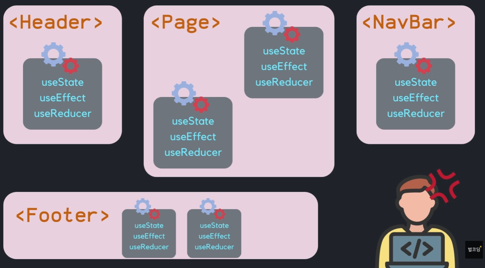
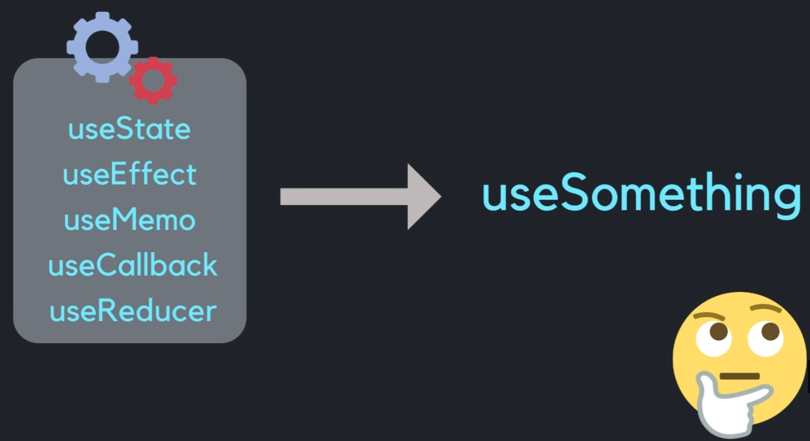
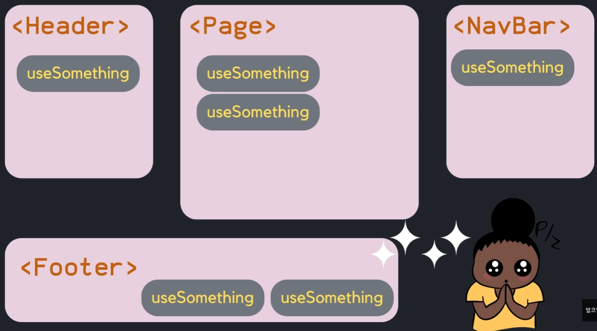

#  중복된 코드가 있으면여 재사용이 가능한 함수로 추출해서 중복코드를 제거

## 중복된 코드가 존재하는 각 콤포넌트



## 중목된 코드로직을 추출하여 함수화



## 추출한 함수를 각 콤포넌트에서 사용



## custom Hook 형식

```typescript
function useEat( food ) {
  // react Hook 사용
  useState
  useEffect
  // 리턴도 개발자가 임의 지정 가능
  return [eat, setEat]
}
```

### custom Hook 을 사용하는 각 콤포넌트에서의 useState, useEffect 는 완전히 독립적이다. 
## ❇️❇️ custom Hook 은 폭발적인 재사용을 제공 ❇️❇️
