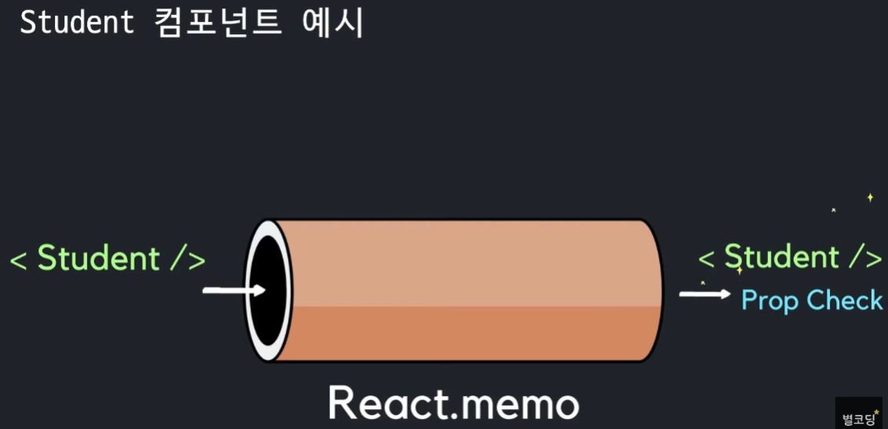
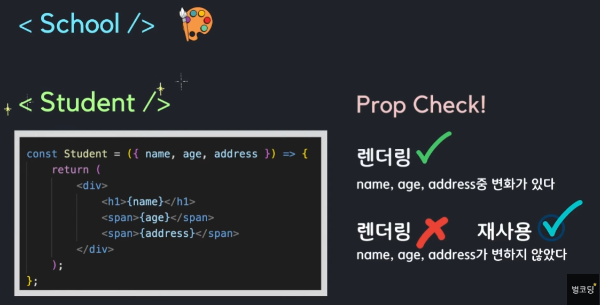
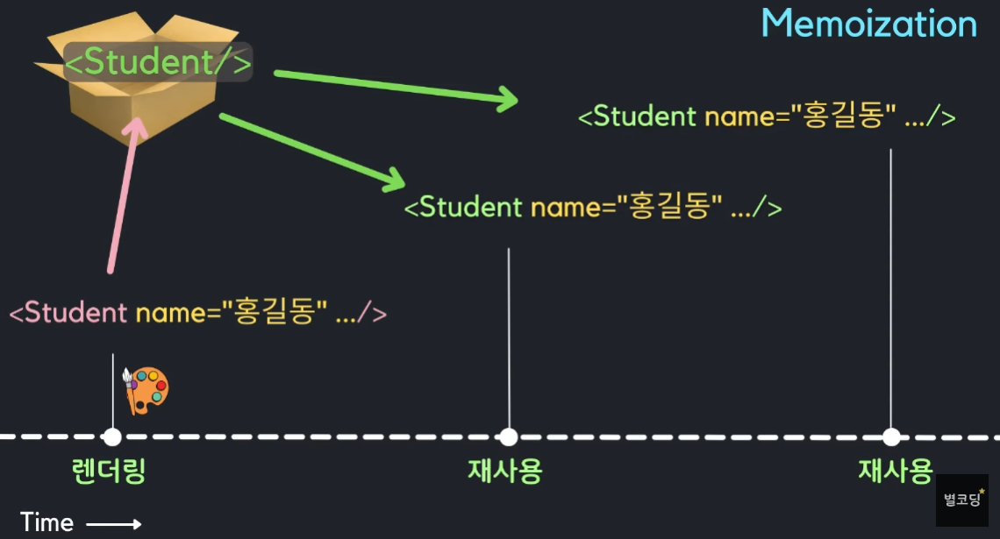

## React.memo 사용 할 적합 한 사항- 콤포넌트가 **`같은 props`** 로 **자주 랜더링이 될때**
- 컴포넌트가 랜더링 될때마다 **`복잡한 로직을 처리`**해야 한다면

### React.memo 는 오직 props 의 변화(**by props check**)에만 의존하는 최척화 방법

#### props 로 자식 콤포넌트를 호출하는 경우 부모 콤포넌트가 랜더링되면 무조건 자식 콤포넌트도 래더링 됨

```typescript
import { useState } from react;

const School = () => {

  const [name, SetName] = useState("");
  const [age, SetAge] = useState(0);
  const [address, SetAddress] = useState("");

  return (
    <div>
      {/* props 로 자식 콤포넌트를 호출하는 경우 부모 콤포넌트가 랜더링되면 무조건 자식 콤포넌트도 래더링 됨 */}
      <Student name={"홍길동"}, age={24}, adress={"서울시 강서구"} />
    </div>
  )
}

export  default School;
```

```typescript
// props 가 변경되지 않았는데도 Student 콤포넌트가 재랜더링되어 구거운 로직 실행
const Student = ({ name, age, address }) => {
  // 무거운 로직 존재 
  return (
    <div>
      <h1>{name}</h1>
      <span>{age}</span>
      <span>{address}</span>
    </div>
  );

}

export default Student;
```

#### ➡️ 자식 콤포넌트로 넘겨주는 props 가 변경되지 않으면 자식 콤포넌트 를  재 랜더링 할 필요가 없다. (by prop check)

*- 그러나 props 의 변화가 없더라도 상태를 관리하는 hook 인 useState, useReducer, useContext 를 사용해서 state 가 변경되면 콤포넌트가 재랜더링 된다*

## **✅ React,memo 의 사용은 꼭 필요 할때 만 사용해야 함 ✅ **

#### React.memo 는 HOC (High Order Component) 로 콤포넌트를 파라미터로 받아서 새로운 콤포넌트를 반환해준다.


#### React.memo 사용 Student 콤포넌트 예시 :: prop check 로 props 의 변화 체크





#### React.memo 사용 Student 콤포넌트 메모리 Memoiztion 개념




