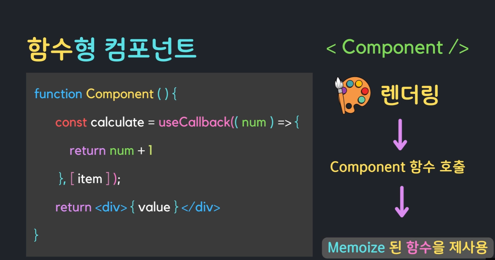

### 컴포넌트 성능을 최적화하는 것으로 함수 자체를 Memoization 하는 것

```typescript
// useCallback() 함수의 기본 구조
const memoizedCallback = useCallback(() => { 
  return valus; 
},[item]);
```

#### 기본 개념: 함수형 콤포넌트가 재 랜더링 되더라도 동일한 함수가 재실행되지 않도록 할 수 있는 개념

