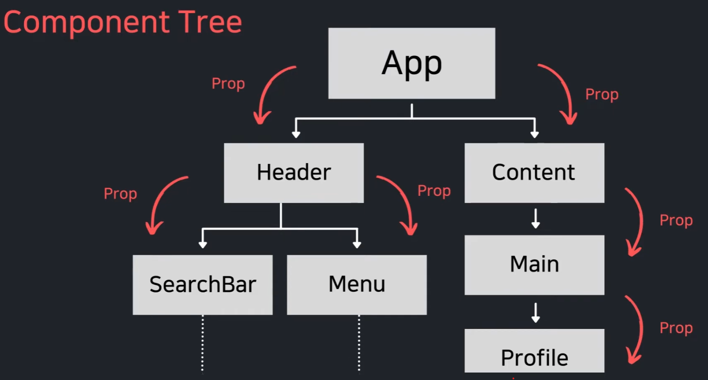
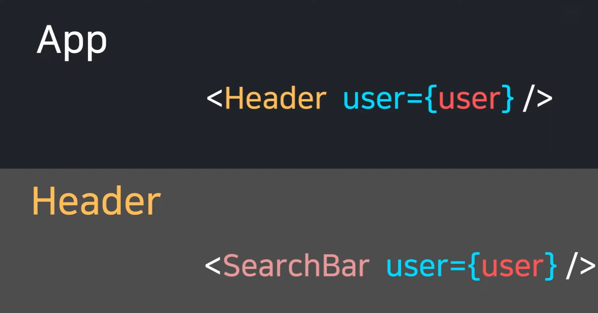
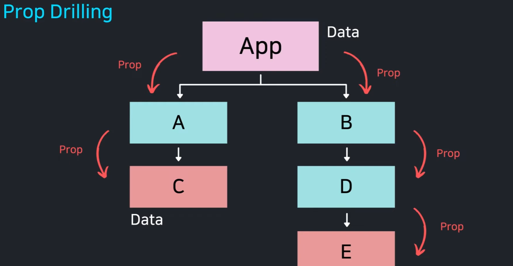

## 1. child component 에 값 전달  (by Prop)






## 2. Context 정보 (전역적인 User 정보, UI Theme 정보, Language 정보 등)를 Child Component 들에게 전달 

**- Context 꼭 필요할째만 사용해야한다. Context 를 사용하면 콤포넌트를 재사용이 어려 질 수 있다.**
**- 테마(Dark/Light), 현재 로그인 유저 정보, 언어 설정(다국어)처럼 앱 전반에 걸쳐 진짜 전역으로 쓰이는 데이터에만 Context를 제한적으로 사용하는 것이 바람직합니다**
**- 자주 변경되는 데이터를 Context 로 만들어서 props 로 전달하면 성능 저하가 발생할 수 있다. 이럴경우에는 Redux, Zustand, Recoil 등과 같은 상태 관리 라이브러리를 사용하는 것이 좋다.**
**- Prop Drilling 을 피하기 위한 목적이라면 Component Composition (콤포넌트 합성)을 먼저 고려해보자**

※ Prop Drilling 문제


### **※ Component Composition (콤포넌트 합성)**
[useContext-Context.md:L14](file:///d:/project-workspace/vite-react-hooks/src/pages/use-context/useContext-Context.md#L14)의 **"Prop Drilling을 피하기 위한 목적이라면 Component Composition(컴포넌트 합성)을 먼저 고려해보자"**는 다음과 같은 의미입니다.

---

1. **Prop Drilling의 문제점**
   - 최하위 자식에게 데이터를 주기 위해, 그 데이터를 사용하지도 않는 중간 컴포넌트들이 단순히 전달 역할만 하면서 코드가 복잡해집니다.

2. **컴포넌트 합성(Component Composition)이란?**
   - 중간 컴포넌트가 하위 컴포넌트를 직접 렌더링하지 않고, **`children` 또는 JSX 엘리먼트를 props로 전달받아 그대로 배치**하는 방식입니다.
   - 데이터를 실제로 알고 있는 최상위 컴포넌트에서 자식 컴포넌트를 직접 조립하기 때문에, 중간 컴포넌트는 데이터를 알 필요도 없고 전달할 필요도 없어집니다.

---

#### ❌ 1. Prop Drilling 방식 (중간 컴포넌트가 props를 계속 토스함)
`Layout`과 `Header`는 `user`를 직접 쓰지도 않는데 오직 `Avatar`에게 넘겨주기 위해 props를 받아 전달해야 합니다.

```tsx
function Page() {
  const [user] = useState({ name: '홍길동' });
  return <Layout user={user} />; // Layout에 전달
}

function Layout({ user }) {
  return <Header user={user} />; // Header에 전달 (안 씀)
}

function Header({ user }) {
  return <Avatar user={user} />; // Avatar에 전달 (안 씀)
}

function Avatar({ user }) {
  return <div>{user.name}</div>; // 여기서 실제 사용
}
```

---

#### ⭕ 2. Component Composition(합성) 방식 (`children` 활용)
최상위 `Page`에서 `Avatar`를 직접 만들어서 안으로 꽂아 넣습니다. 중간 컴포넌트(`Layout`, `Header`)는 `user`를 알 필요가 완전히 사라집니다.

```tsx
function Page() {
  const [user] = useState({ name: '홍길동' });

  // Page에서 Avatar에 user를 직접 주입하고, 완성된 요소를 넘겨줌
  return (
    <Layout>
      <Header>
        <Avatar user={user} />
      </Header>
    </Layout>
  );
}

// Layout과 Header는 user prop을 받을 필요 없이 그저 children만 렌더링
function Layout({ children }) {
  return <div className="layout">{children}</div>;
}

function Header({ children }) {
  return <header className="header">{children}</header>;
}

function Avatar({ user }) {
  return <div>{user.name}</div>;
}
```

---

### 결론
- 단순히 props 전달 단계가 귀찮다고 바로 Context를 도입하면 컴포넌트가 해당 Context에 종속됩니다.
- 위와 같이 **"부모가 컴포넌트를 조립해서 `children`으로 넘겨주는 구조(합성)"**로 바꿀 수 있다면, Context 없이도 깔끔하게 Prop Drilling을 해결할 수 있습니다.