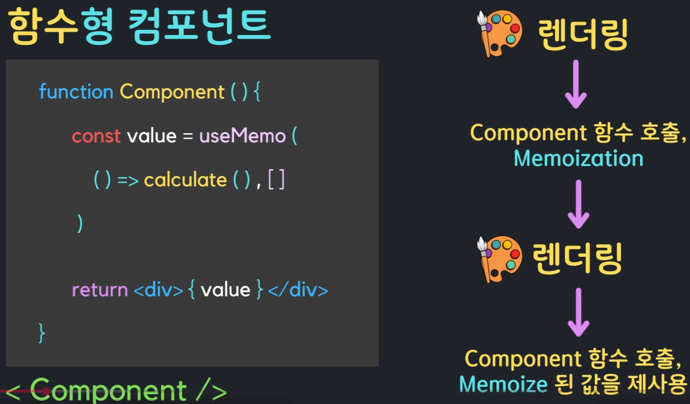

## useMemo : 콤포넌트 성능을 끌어올리는 Hooks

- **memoization(메모이제이션)** : 콤포넌트 내의 특정 기능함수에서 계산된 값을 메모리에 저장  
- **functional component** : 함수형 컴포넌트는 렌더링 될 때 마다 함수 전체를 처음부터 다시 계산함으로 성능이 저하될 수 있다. 이로인한 성능 저하를 막기위해서 useMemo 를 사용한다. 



- **useMemo 패턴**
1. item 이 변경되었을 때에만 calculate 함수가 실행되고 memization 값을 update 한다.
```typescript
const memoizedValue = useMemo(() => {
  return calculate(item);
}, [item]);
```

2. 콤포넌트 처음 랜더링될 때 만 calculate 함수가 실행되고 그 결과 값을 memoization 한다.
```typescript
const memoizedValue = useMemo(() => {
  return calculate();
}, []);

```

### useMemo 를 사용하여 객체 타입의 결과 값을 memoization 하기

- Primitive 타입
  - number, string, boolean 등 원시 자료형
  - 변수에 실제 값 자체가 저장됨
  - 비교 연산자(`===`)로 비교 시 값 자체를 비교

- Object 타입
  - 배열, 객체, 함수 등 참조 자료형
  - 변수에 실제 값이 아닌 **메모리 주소(참조값)**가 저장됨
  - 비교 연산자(`===`)로 비교 시 메모리 주소(참조)를 비교
  - 모양이 같은 객체라도 새로 생성되면 서로 다른 메모리 주소를 가짐 (`{ a: 1 } !== { a: 1 }`)

---

#### 1. 객체를 memoization 하지 않았을 때의 문제점
컴포넌트 내부에 일반 객체 변수를 선언하고 이를 `useEffect` 등의 의존성 배열에 전달하는 경우:

```typescript
// 컴포넌트가 리렌더링될 때마다 매번 새로운 메모리 주소를 가진 객체가 생성됨
const location = { country: isKorea ? "한국" : "미국" };

useEffect(() => {
  console.log("location 변경됨");
}, [location]); // 다른 state(예: number)가 바뀌어 리렌더링될 때도 매번 실행되는 문제 발생!
```
- 컴포넌트가 리렌더링될 때마다 새로운 객체가 생성되어 메모리 주소가 바뀝니다.
- React의 의존성 비교(얕은 비교, `===`)는 메모리 주소를 비교하므로, 내용이 같더라도 `location`이 변경되었다고 판단하여 `useEffect`가 불필요하게 계속 실행됩니다.

---

#### 2. useMemo를 통한 해결 원리 (오해하기 쉬운 포인트, 별도의 primitive 타입의 의존성 배열의 변수로 사용하므로 memozation 효과를 얻는다.)

> ⚠️ **`useMemo`가 객체 내부의 프로퍼티 값을 직접 비교(Deep comparison)해 주는 것이 아닙니다!**

```typescript
// isKorea(원시값)가 바뀔 때만 새로운 객체(새 메모리 주소)를 생성
const location = useMemo(() => {
  return { country: isKorea ? "한국" : "미국" };
}, [isKorea]);

useEffect(() => {
  console.log("location 변경됨");
}, [location]); // isKorea가 바뀔 때만 정상적으로 실행됨
```

- **동작 원리**:
  1. `useMemo`는 의존성 배열에 등록된 **원시값(`isKorea`)의 변화만 비교**합니다.
  2. 다른 상태(`number`)가 변경되어 리렌더링될 때, `isKorea`가 바뀌지 않았다면 새로 객체를 만들지 않고 **이전에 만들었던 객체의 메모리 주소(참조값)를 그대로 재사용**합니다.
  3. 따라서 `useEffect`의 의존성 검사(`이전 location === 새 location`)에서 참조값이 동일하므로, 불필요한 effect 실행을 완벽하게 방지할 수 있습니다.


