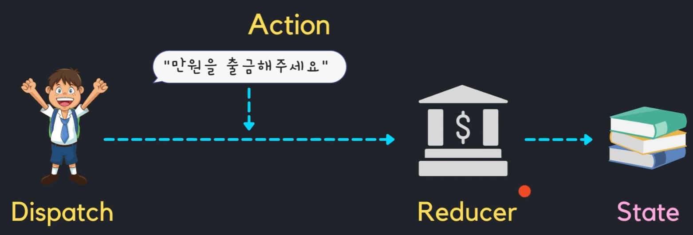
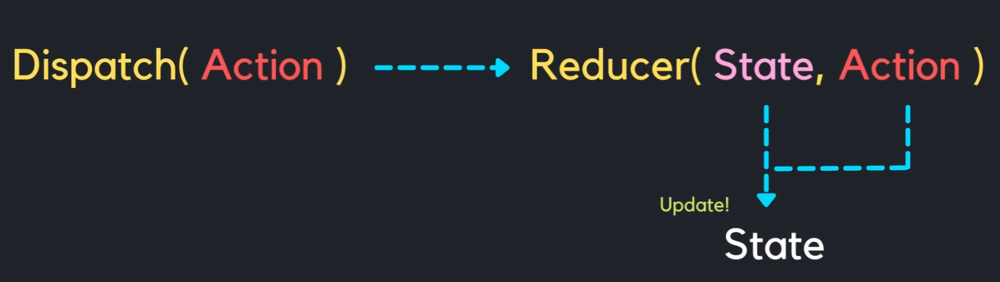

# useReducer 란 ?
**✅ useState 처럼 State 관리하는 또 다른 React Hook**

## 1. userReducer 사용하는 경우
*-객체 내부에 **`여러개의 하위 객체를 가지는 복잡하게 가지는 state를 관리`** 할 경우*
*-**`콤포넌트 내부의 상태관리`**


## 2. useReducer 구성요소

```typescript
const [state, dispatch] = useReducer(reducer, initialState);
``
- 2-1. **Dispatch** : 요구행위 ( 철수가 은행에게 100원을 송금해주세요 )
- 2-2. **Action** : 요구내용 ( 100원을 송금해 주세요 )
- 2-3. **Reducer** : 요구에 따라 state update ( 송금후 통장 거래내역을 update )

[ useReducer 처리 개념 ]


[ useReducer 의 Component 관점에서의 처리 개념 ]
