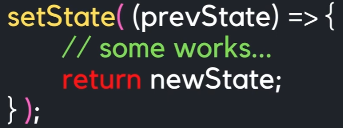
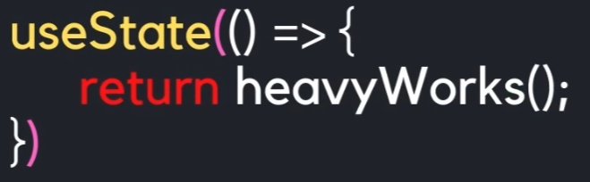

`useState`는 React 컴포넌트에서 **변경되는 값을 상태(state)로 관리하는 Hook**입니다.

### 1. 기본 형태

```tsx
import { useState } from "react";

const [count, setCount] = useState(0);
```

| 부분         | 의미           |
| ---------- | ------------ |
| `count`    | 현재 상태값       |
| `setCount` | 상태값을 변경하는 함수 |
| `0`        | 초기값          |

### 2. 상태 변경
**상태값을 setState 를 통해서 state 를 변경하면 컴포넌트가 다시 redering 된다.**

```tsx
const [count, setCount] = useState(0);

const increase = () => {
  setCount(count + 1);
};
```

`setCount()`가 호출되면 React가 **상태를 변경하고 컴포넌트를 다시 렌더링**합니다.

```text
초기 상태
count = 0
   ↓
setCount(1)
   ↓
React가 다시 렌더링
   ↓
count = 1
```

### 3. 가장 흔한 예

```tsx
import { useState } from "react";

export default function Counter() {
  const [count, setCount] = useState(0);

  return (
    <div>
      <p>Count: {count}</p>

      <button onClick={() => setCount(count + 1)}>
        증가
      </button>
    </div>
  );
}
```

버튼을 클릭할 때마다:

```text
count = 0
  ↓
count = 1
  ↓
count = 2
  ↓
count = 3
```

### 4. 문자열도 가능

```tsx
const [name, setName] = useState("");
```

```tsx
setName("홍길동");
```

### 5. 객체도 가능

```tsx
const [user, setUser] = useState({
  name: "",
  age: 0,
});
```

변경할 때는 기존 객체를 복사하는 방식이 일반적입니다.

```tsx
setUser({
  ...user,
  name: "홍길동",
});
```

**핵심은 이것 하나로 기억하면 됩니다.**

```tsx
const [상태값, 상태변경함수] = useState(초기값);
```

즉, **`useState` = "컴포넌트가 기억해야 하는 값을 만들고 변경하는 기능"**이라고 이해하면 됩니다.

### 6. setState 애 Callback 함수 사용
➡️ 새롭게 변경할 state 가 이전 state 와 연관이 되어 있는 경우
➡️ 인자로 이전 state 새로운 state 를 리턴 하는 callback 함수 사용 



### 7. useState를 사용해서 초기 값을 받아오는 경우 callback 함수 사용
➡️ 초기 값을 받아 올때 어떤 무거운 작업을 해야 된다면 useState 의 인자로 Callback 함수로 무거눙 작업 실행
➡️ 컴포넌트가 맨처음 rendering 될때 한번만 무거운 작업 실행




